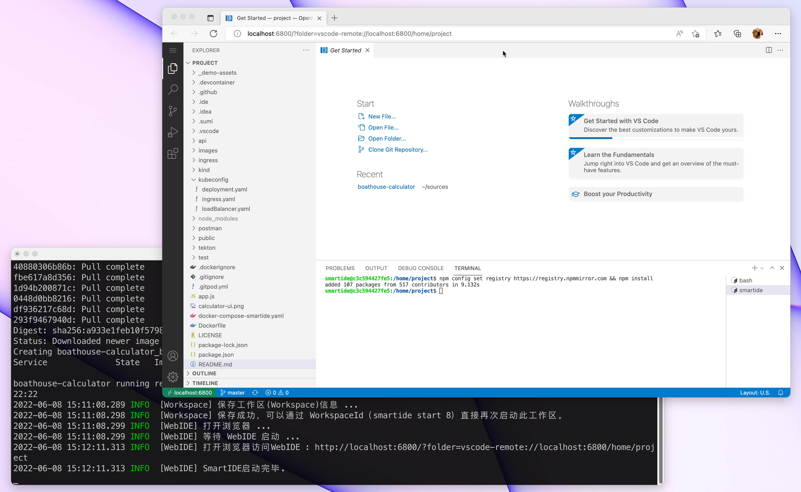
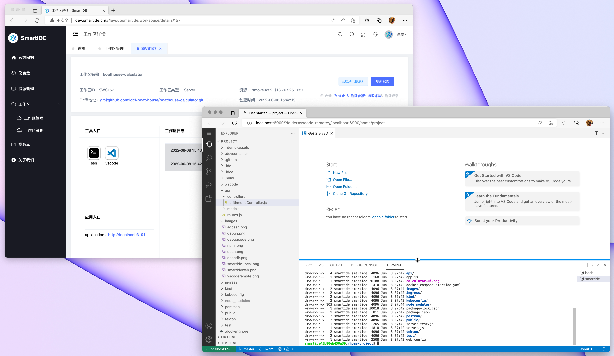

# Calculator.js:  node.js 演示项目    2022-07-27
   
本应用使用node.js创建，并包含了试用mocha的单元测试代码。本应用的运行状态为网页中的计算器，如下图：


代码中使用node.js代码提供了REST APIs，其中提供各种数学计算功能单元。

使用mocah编写的测试代码可以完成所有以上API内部运算运算逻辑的验证，最终使用 `mocha-junit-reports` 来生成XML格式的测试结果文件以便 [Azure DevOps](https://azure.com/devops) 可以读取测试结果提供DevOps流水线的测试集成。

## 使用 SmartIDE 开发和调试

### Open in SmartIDE 一键启动模式

点击以下按钮即可一键启动当前代码库的开发调试环境。

[](https://dev.smartide.cn/#https://github.com/idcf-boat-house/boathouse-calculator.git)

Open in SmartIDE @ GitEE

[](http://ws.gitee.work:8080/#git@gitee.com:idcf-boat-house/boathouse-calculator.git)


### CLI 本地模式

1. **安装** 参考 [安装手册](https://smartide.cn/zh/docs/install/cli/) 完成CLI的本地安装，SmartIDE CLI 支持 Windows/MacOS/Linux 三大主流操作系统。

2. **一键启动** 使用以下指令即可启动WebIDE开始开发和调试

```shell
## 使用GitHub
smartide start https://github.com/idcf-boat-house/boathouse-calculator.git
## 使用Gitee
smartide start https://gitee.com/idcf-boat-house/boathouse-calculator.git
```

启动后的效果如下



### CLI 远程主机模式

远程主机模式允许开发者使用一台Linux主机作为SmartIDE的开发资源，将开发环境一键漫游到这台主机上。开发环境主机可以是位于任何位置的物理机或者虚拟机，无需开放除了SSH端口以外的其他网络端口。

主机环境要求：主机上需要需要预装 Docker 环境，请参考 [安装手册](https://smartide.cn/zh/docs/install/docker/linux/)。

远程主机模式的启动指令与本地模式保持一致，只需要添加 --host <主机ID> 参数即可。

运行以下指令添加主机到 SmartIDE CLI 并启动环境。

```shell
## 添加主机
## 如果采用SSH-KEY认证方式，可以省略 <SSH密码> 参数
smartide host add <主机IP或者域名> --username <SSH用户名> --password <SSH密码> --port <SSH端口>

## 执行成功后，CLI会返回 主机ID，也可以使用以下指令查询主机列表
smartide host list

## 使用主机模式启动环境
## 使用GitHub 
smartide start --host <主机ID> https://github.com/idcf-boat-house/boathouse-calculator.git
## 使用Gitee
smartide start --host <主机ID> https://gitee.com/idcf-boat-house/boathouse-calculator.git
```

### Server 模式

SmartIDE Server 为开发团队提供对开发环境的统一在线管理和访问能力，企业管理者可以通过SmartIDE Server为开发团队提供统一的一致的开发环境，大幅降低开发者花费在搭建环境上的时间消耗，让开发者可以将更多的精力投入到业务需求开发和技术方案改进上。更为重要的是，SmartIDE Server提供了完全受控的开发测试环境，管理者可以通过工作区策略对开发环境进行管理。

Server一键启动按钮，点击此按钮即可启动开发调试环境

[](http://dev.smartide.cn/#/layout/smartide/workspace/details/157)

启动后的效果如下



- 在线版地址 https://dev.smartide.cn 
- Server版快速启动手册 https://smartide.cn/zh/docs/quickstart/server/ 

SmartIDE Server 已经开放内测，请进入 [官网](https://smartide.cn) 扫描页面底部二维码即可申请加入。

## 本地构建本项目的方式 

1. 运行 `npm install` 安装所有依赖包
2. 运行 `npm test` 运行所有测试
3. 运行 `npm start` 启动应用，并打开 http://localhost:3000

使用Docker构建和运行项目的方式：

1. 复制 _demo-assets/demo-dockerfile 到根目录下的Dockerfile文件

2. 运行以下命令完成 `calculator` 容器构建打包

```shell
docker build -t calculator .
```

2. 运行 `calculator` 容器

```shell
docker run -itd -p 8080:3000 calculator
```

打开 http://localhost:8080 

应用启动后的状态如上图。


## SonaQube 运行

使用Docker容器的方式运行sonar-scanner-cli

将 sonar-project.properties 移动到根目录，然后运行一下命令

```shll
docker run \
    --rm \
    -e SONAR_HOST_URL="http://{SonaQubeServerUrl}" \
    -e SONAR_LOGIN="{Token}" \
    -v "${PWD}:/usr/src" \
    sonarsource/sonar-scanner-cli
```

## Run Postman Collection in Docker

使用PostMan编写和运行API测试


```shell
# install newman to run postman collections in command line https://www.npmjs.com/package/newman
npm install -g newman
# install newman-reporter-junit to export test report in juntest format https://www.npmjs.com/package/newman-reporter-junitfull
npm install -g newman-reporter-junitfull

## newman sample command
newman run postman/boathouse-calculator.postman_collection.json -e postman/local-dev.postman_environment.json

## newman sample command with junit report export
newman run postman/boathouse-calculator.postman_collection.json -e postman/local-dev.postman_environment.json -r junitfull --reporter-junitfull-export './postman/result.xml' -n 2
```

```shell
## run newman using the newman docker container
docker run -v "${PWD}/postman:/etc/newman" -t postman/newman:alpine run boathouse-calculator.postman_collection.json -e local-dev.postman_environment.json
## with junit format report 
docker run -v "${PWD}/postman:/etc/newman" -t postman/newman:alpine run boathouse-calculator.postman_collection.json -e local-dev.postman_environment.json --reporters junit --reporter-junit-export 'result-docker.xml'
```

## Open In SmartIDE With xxx Image

[smartide start with base image](https://dev.smartide.cn/#/layout/smartide/workspace?gitRepoUrl=git@github.com:idcf-boat-house/boathouse-calculator.git&branch=master&configFilePath=.ide/base.ide.yaml)

[smartide start with base-vmlc image](https://dev.smartide.cn/#/layout/smartide/workspace?gitRepoUrl=git@github.com:idcf-boat-house/boathouse-calculator.git&branch=master&configFilePath=.ide/vmlc-base.ide.yaml)

[smartide start with base-vmlc-vscode image](https://dev.smartide.cn/#/layout/smartide/workspace?gitRepoUrl=git@github.com:idcf-boat-house/boathouse-calculator.git&branch=master&configFilePath=.ide/vmlc-vscode.ide.yaml)

